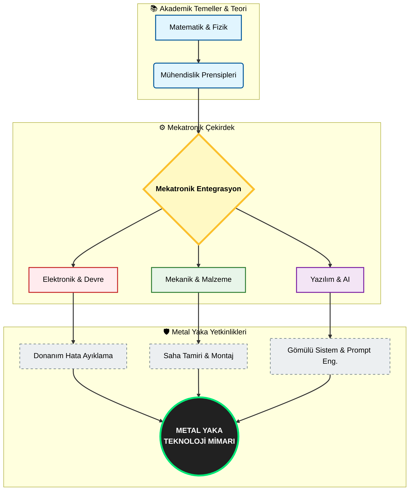
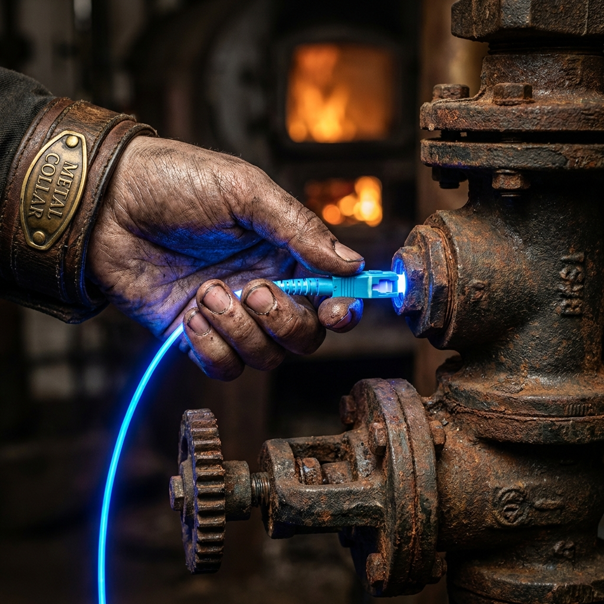
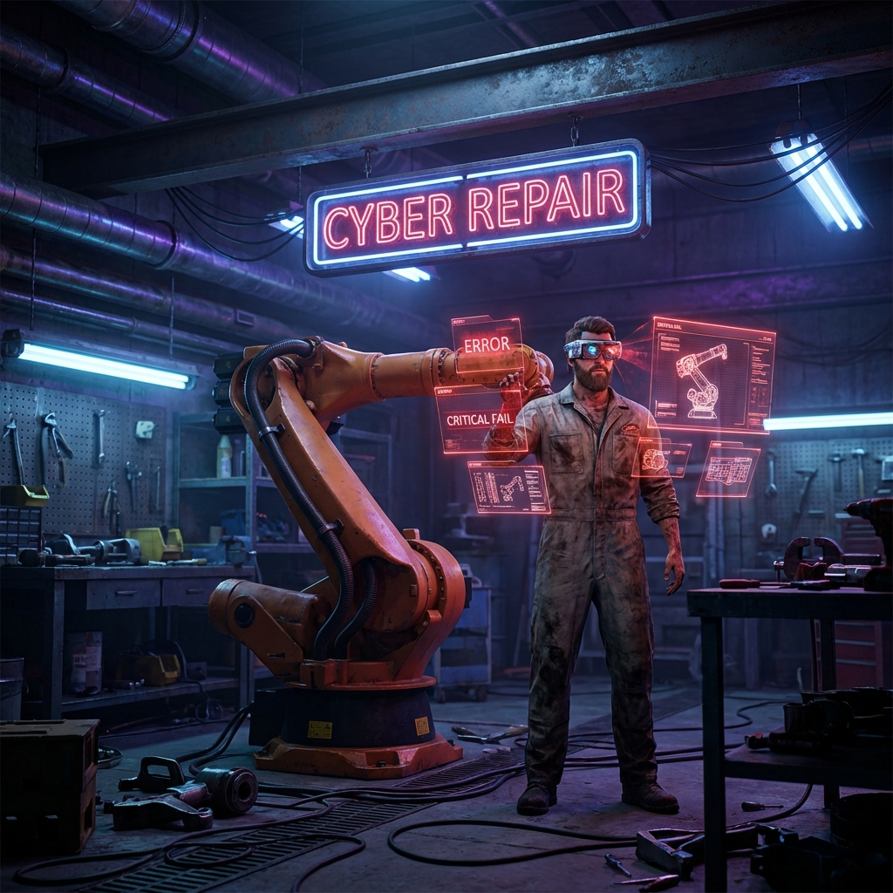
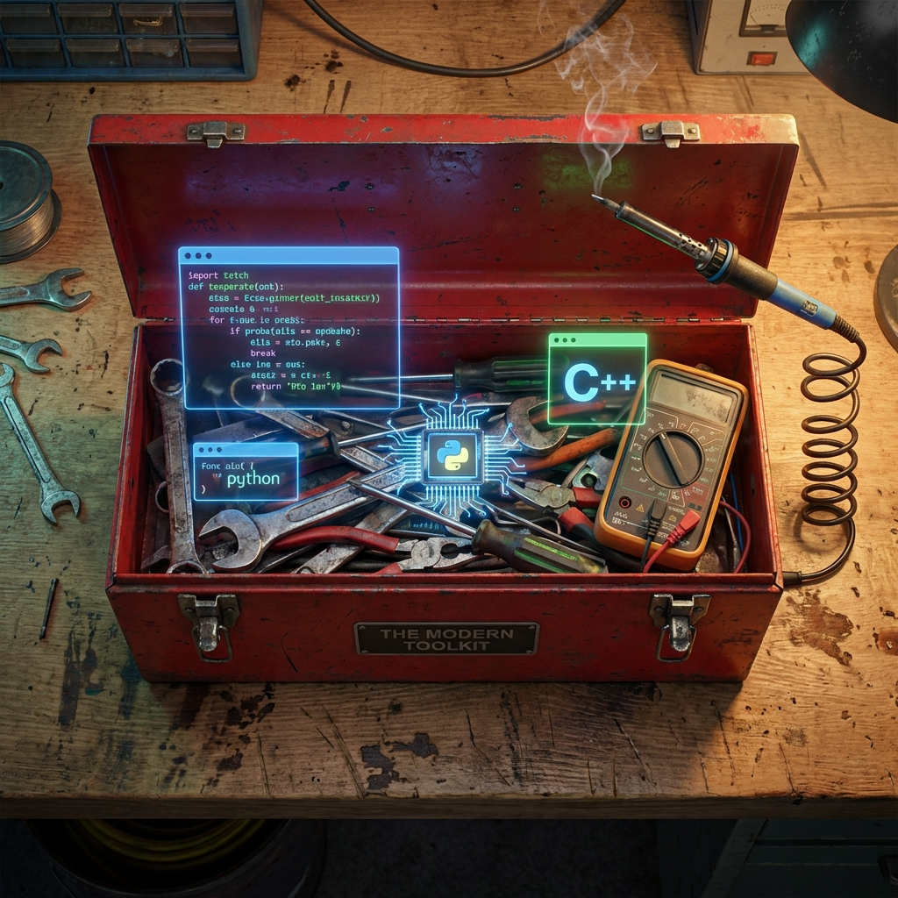
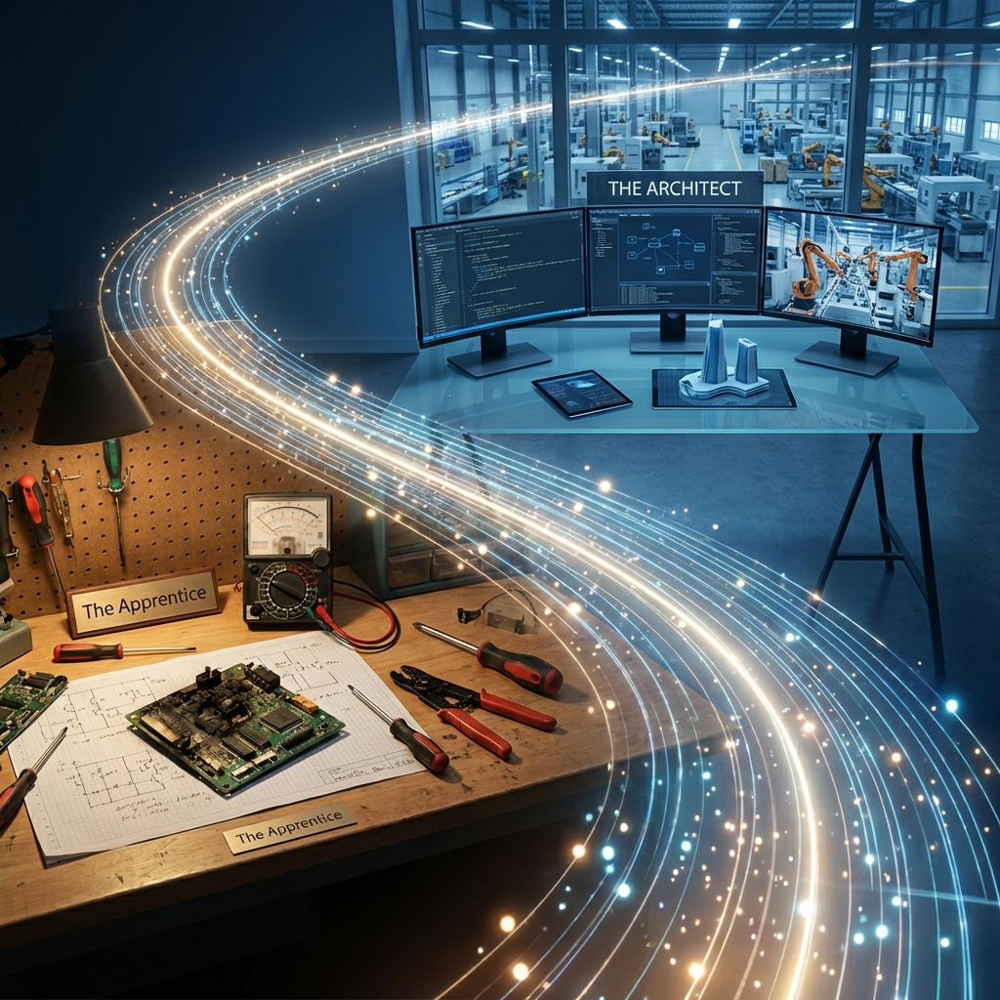

# 🤖 Türkiye Mekatronik & Endüstriyel Otomasyon Rehberi: Dijital Tesisatçılık ve Siber Tamir Atölyesi

> **Türkiye Cumhuriyeti'nin Gelecekteki "Metal Yaka" Teknikerleri, Mühendisleri ve "Teknoloji Mimarları" İçin Nihai Bilgi Üssü**  
> *Bu eser, Türkiye Cumhuriyeti'nin teknolojik bağımsızlık mücadelesine ve ülkenin dört bir yanındaki Meslek Yüksekokulları ile Teknik Fakültelere ithaf edilmiştir.*

## 📖 Bu Depo Hakkında: Tasarım Çağının Sonu, Entegrasyon Çağının Başlangıcı

**Türkiye Mekatronik Rehberi** deposuna, daha doğrusu **atölyesine** hoş geldiniz. Bu proje, sıradan bir üniversite ders notları arşivi olmanın, PDF'lerin ve slaytların saklandığı tozlu bir raf olmanın çok ötesindedir. Burası; Edirne'den Kars'a, Samsun'dan Hatay'a kadar tüm Türkiye'deki Mekatronik öğrencileri, organize sanayi bölgelerinde (OSB) ter döken mühendisler, üretim bandındaki teknikerler ve geleceğin teknolojisini elleriyle şekillendiren "Metal Yaka" zanaatkarları için canlı, nefes alan bir manifestodur.

Amacımız, sadece vize ve finalleri geçirmek değil, **Yapay Zeka (AI)** devrimi sonrası temellerinden sarsılan ve yeniden kurulan endüstriyel dünyada ayakta kalacak, vazgeçilmez bir mesleki kimlik inşa etmektir. Türk sanayisinin ihtiyacı olan şey sadece diploma değil, **"sahada iş çözen"** nitelikli insan gücüdür.

Bu depo, akademik dünyanın köklü **teorik derinliği** ile; Türkiye'nin dört bir yanındaki sanayi bölgelerinin, iş makinelerinin gürültüsü ve metalin kokusuyla dolu **pratik endüstriyel uygulamasını** birleştiren eşsiz bir köprüdür. 20. yüzyılın mühendislik yaklaşımı olan "her şeyi sıfırdan hesapla ve tasarla" devri kapanmıştır. Artık "AI'ın saniyeler içinde tasarladığı karmaşık sistemleri fiziksel dünyada birbirine bağla, yaşat, entegre et ve hatasız çalıştır" devri başlamıştır. Bu depo, diferansiyel denklemlerin soyut dünyasından çıkıp, o denklemlerin çalıştırdığı robot kolunun hidrolik sızıntısını tamir etmeye giden engebeli yolun detaylı haritasıdır.

### 🛡️ Manifesto: AI Çağının Tesisatçıları ve Siber Tamircilik

> *"Bizler tasarımcı değiliz; bizler dijital çağın tesisatçılarıyız. AI, mimar gibi sistemi tasarlar, kodunu yazar, devre kartını çizer; biz ise o sistemi fiziksel dünyada inşa eder, kablosunu çeker ve yaşatırız."*

2023 yılında başlayan Yazılım Mühendisliği serüvenimde, Yapay Zeka'nın (AI) tasarım, kodlama, optimizasyon ve veri analizi gibi insan beyni gerektiren bilişsel süreçleri nasıl inanılmaz bir hızla domine ettiğine, metalaştırdığına ve ucuzlattığına bizzat şahit oldum. Bugün geldiğimiz noktada AI, insan zekasının saatler, hatta günler süren karmaşık hesaplamalarını saniyeler içinde hatasız bir şekilde tamamlayabiliyor. Bu baş döndürücü değişim karşısında, AI öncesi dönemin hantal, yavaş ve tamamen teorik hesaplamalara odaklanan klasik "beyaz yaka" mühendislik yaklaşımının (hesap yapan mühendis) yetersiz kaldığını ve hatta sahada geçerliliğini yitirdiğini gördüm.

Bu radikal farkındalık ve varoluşsal kriz beni, dijitalin soyut, temiz ve güvenli ofis dünyasından; üretimin somut, fiziksel, kaotik, gürültülü ve "kirli" kalbine itti: **Mekatronik**. Ancak bu, teknolojiden ve yazılımdan bir kaçış veya geri dönüş değildir; aksine teknolojinin en uç noktası olan AI'ı, metale, elektriğe ve harekete hükmetmek için bir araç olarak kullanma stratejisidir. Gelecekte ekrana bakıp sadece "kod yazan" değil; yazdığı kodu makineye işleyen, "kodu metale dönüştüren" kazanacaktır.

**Metal Yaka İnisiyatifi** ve bu deponun varoluş sebebi nettir: Hesaplama kapasitesinde ve tasarım hızında AI ile beyhude bir yarışa girmek yerine; onun ürettiği kusursuz çıktıları, şemaları ve kodları bir kaldıraç olarak kullanıp, bu dijital mükemmelliği fiziksel gerçeklikte hayata geçirmektir. Bu depo, ne sadece ofiste oturan beyaz yaka, ne de sadece tezgah başında bekleyen mavi yaka olan; ikisinin sentezi, hibrit bir süper çalışan olan **"AI Destekli Zanaatkar"** yani **Metal Yaka** çalışanları, yeni nesil **Siber Tamirciler** ve **Dijital Tesisatçılar** içindir.

Bizler, iki dünya (Sanallık ve Gerçeklik) arasındaki köprüyüz. AI, sistemin dijital mantığını, optimizasyonunu, verimliliğini yönetirken; bizler fiziksel gerçeği, montajı, entegrasyonu, sürtünmeyi ve arızayı yönetiriz. AI bir bina çizer gibi robotu tasarlar; bizler ise o robotun "tesisatını" (kablolarını, pnömatik hortumlarını), "sinirlerini" (haberleşme hatlarını, sensörlerini) döşer ve "damarlarındaki" (güç elektroniği, motor akımları) tıkanıklığı açarız. İşte bu, **Tekniker 2.0**'ın geleceğidir: Tezgah başında, elinde multimetre ve tork anahtarı, önünde tablet ve osiloskop; yazılımın sonsuz gücünü somut, çalışan, değer üreten bir makineye dönüştüren hibrit bir profesyonel.

### 🎯 Vizyon & Misyon: Yeni Tamircilik Kültürü

*   **Vizyon:** Yapay zeka destekli ileri tasarım tekniklerini, yüzyılların getirdiği "Usta-Çırak" ve Anadolu'nun "Ahi" kültürüyle, modern endüstriyel zanaatkarlıkla harmanlayan; "masa başı" raporlayan değil "tezgah başı" çözüm üreten; duran fabrikaları, arıza yapan otonom sistemleri, kilitlenen robotları hayata döndüren **"Metal Yaka"** iş gücünü oluşturmak.
*   **Misyon:** Karmaşık teorik hesaplamaların yükünü AI asistanlarına devredip, insanın odak noktasını "Arıza Tespiti (Diagnosis)", "Sistem Entegrasyonu" ve "Sistemi Ayakta Tutma" sanatına kaydırarak; AI'ın kusursuz hesaplamalarını gerçek, fiziksel ve çalışan makinelere dönüştürmek için gereken pratik, tecrübeye dayalı "kirli el" bilgisini **tüm Türkiye için** erişilebilir kılmak (demokratize etmek).

---

## 🏗️ Depo Yapısı ve "Tamircinin Bakış Açısı"

Bu depo, YÖK uyumlu modern bir Mekatronik/Otomasyon müfredatını, akademik başlıklar altında ancak tamamen endüstriyel "bakım/onarım/entegrasyon" ihtiyaçlarını yansıtacak şekilde yeniden yorumlamıştır. Her modül bir "Saha El Kitabı"dır.

| Dizin | Konvansiyonel İsim | SİBER TAMİRCİ ODAĞI & METAL YAKA PERSPEKTİFİ |
|-----------|-------------|----------------------------------------------------|
| [`01_Engineering_Fundamentals`](./01_Engineering_Fundamentals/) | Mühendislik Temelleri | **Teori Değil, Teşhis (Diagnosis):** Biz Kalkülüs ve Fiziği; köprü tasarlamak için değil, AI tarafından tasarlanan köprünün neden rüzgarda titrediğini anlamak için öğreniyoruz. Diferansiyel denklem bizim için bir "arıza tespit cihazı"dır. Türev, hatanın artış hızıdır. İntegral, birikmiş hatadır. Formüller, makinenin röntgenidir. |
| [`02_Electrical_Electronics`](./02_Electrical_Electronics/) | Elektrik & Elektronik | **Fiziksel Hata Ayıklama (Physical Debugging):** Yazılımcı kodundaki hatayı 'debug' eder, "Undo" yapar. Biz ise yanmış bir MOSFET'i, temassızlık yapan paslı bir konnektörü 'debug' ederiz. Elektronikte "Undo" yoktur, "Patlama" vardır. Osiloskop, lehim havyası ve multimetre ile "Devre Cerrahlığı" yaparız. AI şemayı çizer, ama soğuk lehimdeki temassızlığı AI göremez, biz görürüz. |
| [`03_Mechanics_Materials`](./03_Mechanics_Materials/) | Mekanik & Malzeme | **Metalin Yorgunluğu ve Ruhu:** Dijital simülasyonlarda malzeme asla yorulmaz, yağ bitmez, vida gevşemez. Gerçek dünyada ise metal yorulur ve kırılır. AI'ın simülasyonlarını gerçek dünyanın yıpratıcı şartlarıyla (toz, yağ, titreşim, korozyon) test ederiz. Bir makineyi tamir etmek, onun nasıl kırıldığını anlamakla başlar. Dişli boşluğunu (backlash) ve sürtünmeyi yönetiriz. |
| [`04_Programming_Embedded`](./04_Programming_Embedded/) | Programlama & Gömülü | **İstemi Mühendisliği (Prompt Engineering) & Kod Enjeksiyonu:** Sıfırdan C++ sürücüsü yazmakla vakit kaybetmeyiz; bunu AI'a yazdırırız. Bizim işimiz, o kodu alıp STM32'nin kısıtlı hafızasına sığdırmak (Gömme), gerçek zamanlı (Real-Time) çalışmasını sağlamak, kesmeleri (interrupts) yönetmek ve donanımla konuşurken "kekelemediğinden" emin olmaktır. Biz kodun donanımla dansını yönetiriz. |
| [`05_Control_Robotics`](./05_Control_Robotics/) | Kontrol & Robotik | **Robot Doktorluğu & Acil Servis:** 6 eksenli devasa bir robot kolu 'Singularity' (Tekillik) noktasına girip kilitlendiğinde veya enkoder hatası verdiğinde, AI ekrana sadece "Error 404" yazar. O robotu "ameliyat" edip, frenlerini açıp, manuel olarak eksenlerini sıfırlayıp hayata döndüren biziz. Biz otonom ve akıllı sistemlerin acil servis ekibiyiz. |
| [`06_Projects_Labs`](./06_Projects_Labs/) | Projeler & Laboratuvar | **İspat Meydanı ve Hurdalık:** "Hello World" yazan kodlar değil, "Hello World" diyerek hareket eden, iş yapan makineler. Burası, teorinin pratiğe çarptığı sert duvardır. Çalışmayan projeleri, yanan motorları, patlayan kondansatörleri burada belgeleriz. Çünkü en iyi mühendis, en çok parça bozan ve hatasını anlayandır. |

---

## 🛠️ Teknoloji Yığını & Tamir Çantası

Modern bir Mekatronik Teknikerinin, yani Metal Yaka mühendisinin alet çantası; hem dijital (yazılım/AI) hem de fiziksel (donanım/tamir) araçlarla doludur ve bu iki dünya arasında akışkan bir geçiş gerektirir.

### 💻 Yazılım & Gömülü Sistemler (Dijital Teşhis Cihazları)
*   **Diller:** C ve C++ (Donanımla, bitlerle ve baytlarla konuşmak için), Python (AI modelleriyle ve veri analiziyle konuşmak için), MATLAB (Sistemin hastalığını simüle etmek için).
*   **Gömülü Platformlar:** STM32 (Endüstriyel standart, ARM mimarisi) ve ESP32 (IoT). Bunlar sadece silikon çip değildir; makinenin beynidir. Bir beyin cerrahı titizliğiyle, register (yazmaç) seviyesinde müdahale ederiz.
*   **RTOS (Gerçek Zamanlı İşletim Sistemi):** Makinenin kalp ritmini ve zamanlamasını yönetiriz. Görevleri (Tasks) önceliklendiririz.

### ⚙️ Mekanik & Tasarım (Fiziksel Müdahale Araçları)
*   **CAD (Bilgisayar Destekli Tasarım):** SolidWorks ve Fusion 360. Bozulan, kırılan bir parçayı yeniden çizmek ve 3D yazıcıda basmak için. "Yedek parça bekleme, kendin üret" felsefesi.
*   **Tersine Mühendislik:** Bir makinenin nasıl çalıştığını (veya neden bozulduğunu) anlamak için onu söküp sanal ortamda yeniden oluşturmak.

### 🔌 Elektronik & Kontrol (Sinir Ağı Onarımı)
*   **EDA (Elektronik Tasarım Otomasyonu):** Altium Designer ve KiCAD. Yanmış bir kontrol kartının yerine daha iyisini, daha dayanıklısını tasarlayıp üretmek için.
*   **PLC & Otomasyon:** Siemens TIA Portal. Fabrikanın işletim sistemi. Bir fabrikayı durduran o sinsi "bug"ı bulup, milyon dolarlık üretimi yeniden başlatmak.
*   **ROS (Robot İşletim Sistemi):** Modern robotların dili. Otonom bir aracın sensör verilerini nasıl işlediğini anlamak ve sensör körleştiğinde (Lidar arızası vb.) müdahale etmek.

---

## 🚀 Kariyer Yol Haritası: Çıraklıktan Arıza Uzmanlığına

Mekatronik, disiplinler arası uçsuz bucaksız bir okyanustur. Bu okyanusta "usta" olmak, her şeyi teorik olarak bilmek değil, karşılaştığın her sistemi "tamir edebilmek" ve "yürütebilmek" demektir.

### Faz 1: Çırak - Aleti Tanıma ve Saygı Duyma (Yıl 1-2)
Bu aşamada amacımız, elimizdeki aletlerin (hem yazılım hem donanım) dilini çözmek ve limitlerini öğrenmektir.
*   [ ] **Multimetre ile Dost Olun:** Bir devredeki kısa devreyi, ekrandaki kodunuza bakarak bulamazsınız. Ölçmeyi, prob tutmayı öğrenin.
*   [ ] **Kodu AI'a Yazdırın, Siz Okuyun:** C++ sözdizimini ezberlemekle aylar kaybetmeyin. AI'ın yazdığı kodun donanımda ne yaptığını (Hangi transistörü açtığını, hangi veriyi gönderdiğini) satır satır anlayın.
*   [ ] **İlk Patlama:** Bir kondansatörü ters bağlayıp veya bir LED'i dirençsiz bağlayıp patlatın. Çıkan o koku, bir mühendisin vaftiz törenidir. O korkuyu yaşayın.

### Faz 2: Kalfa - Sorun Çözme ve Entegrasyon (Yıl 3)
Artık basit devreler kurmuyorsunuz, karmaşık sistemlerin neden çalışmadığını, neden uyumsuzluk çıkardığını buluyorsunuz.
*   [ ] **Hata Ayıklama (Debugging) Sanatı:** Yazılımdaki "breakpoint" neyse, elektronikteki "osiloskop" odur. Gürültüyü, paraziti, dalgalanmayı gözünüzde görün.
*   [ ] **Mekanik Entegrasyon:** Motoru boşta döndürmek kolaydır; motoru bir yüke bağlayıp, mili kırmadan, dişliyi sıyırmadan o yükü kaldırmak gerçek mühendisliktir.
*   [ ] **Datasheet Okuryazarlığı:** Bir çipin veya sensörün 100 sayfalık kullanım kılavuzunu (datasheet) okumak, bir doktorun hastanın röntgenini okuması gibidir. Her şey orada yazar.

### Faz 3: Usta / Baş Teknisyen - Sistem Mimarı (Yıl 4+)
Parçaları değil, sistemin bütününü, mimarisini ve ruhunu yönetirsiniz.
*   [ ] **Sistem Doktorluğu:** Robot kolu hafifçe titriyor mu? Sorun PID katsayısında mı (yazılım), redüktör dişlisindeki boşlukta mı (mekanik), yoksa enkoder kablosundaki parazitte mi (elektronik)? Bunu tek bakışta, sesten ve titreşimden anlamak.
*   [ ] **AI Entegrasyonu:** Bir kamerayı robota bağlayıp, AI'ın gördüğü (Computer Vision) şeye göre robotun fiziksel dünyada hareket etmesini sağlamak. Dijital beyni, metal gövdeye hükmeder hale getirmek.
*   [ ] **Kendi Aletini Yap:** İhtiyaç duyduğun cihaz, sensör veya yazılım piyasada yoksa; oturup tasarla, kodla, üret ve kullan.

---

## 🤝 Katkıda Bulunma: Atölyeye Hoş Geldiniz

Açık kaynak felsefesine ve Anadolu'nun İmece kültürüne yürekten inanıyoruz. İster bir meslek lisesi öğrencisi olun, ister bir MYO öğrencisi, isterse sahada yıllanmış bir usta. Bilgi ve tecrübeniz bu kütüphane için paha biçilemezdir.

Lütfen kod standartlarımız, katkı süreci ve topluluk kurallarımız için [`CONTRIBUTING.md`](./CONTRIBUTING.md) dosyasını dikkatlice okuyun. Bilgi, paylaştıkça çoğalan ve değerlenen tek hazinedir.

## 📜 Lisans

Bu proje, bilginin özgürce dolaşımını ve herkesin erişimini desteklemek amacıyla **MIT Lisansı** altında lisanslanmıştır. Detaylar ve yasal haklar için [`LICENSE`](./LICENSE) dosyasına göz atabilirsiniz.

---

## 👨‍💻 Mimar ve Baş Teknisyen Hakkında

<table align="center">
  <tr>
    <td align="center" width="150">
       
      <b>Bahattin Yunus Çetin</b>
    </td>
    <td>
      <b>IT Architect (Bilişim Mimarı) & Metal Yaka Vizyoneri</b> 
      Konum: <b>Şereflikoçhisar / Ankara</b>  
      <i>"Köklerim Şereflikoçhisar'ın bozkırında, vizyonum ise dijital geleceğin zirvesindedir. Ben, AI'ın tasarladığı dijital dünyayı fiziksel dünyada inşa eden, kablolarını çeken, otonom makinelerin nabzını tutan ve onları yaşatan bir Teknoloji Mimarıyım."</i>  
      
      
    </td>
  </tr>
</table>

---

  © 2026 Türkiye Mekatronik ve Otomasyon İnisiyatifi. "Metal Yaka" devrimi burada başlıyor. Tüm hakları saklıdır.

